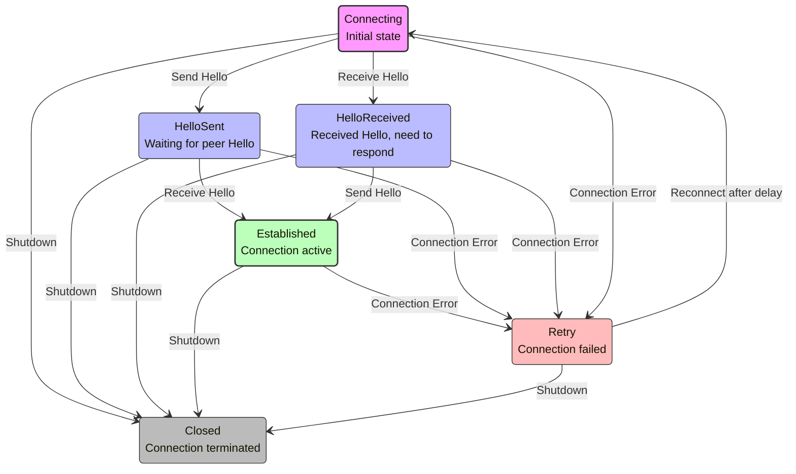

# MetalBond_rs Architecture

This document describes the architecture of the MetalBond_rs system, explaining its components, how they interact, and the design decisions that were made.

## System Overview

MetalBond_rs is a distributed route exchange system that enables seamless integration between different virtual networks. It consists of several key components working together to provide efficient route management and distribution.

## Component Architecture

### Core Components

1. **MetalBond Core**
   - Central orchestrator that manages all components
   - Handles lifecycle of peers, routes, and subscriptions
   - Provides API for higher-level applications
   - Implemented as a frontend that sends commands to a backend actor

2. **RouteTable**
   - Lock-less table for storing and querying routes
   - Efficiently maps VNIs to destinations to next hops
   - Tracks route sources for proper clean-up on peer disconnect
   - Implemented as an actor that processes commands sequentially

3. **Peer Management**
   - Manages connections to remote MetalBond instances
   - Implements the MetalBond wire protocol
   - Handles connection state, keepalives, and reconnection
   - Each peer operates as an independent actor

4. **Network Client**
   - Platform-specific abstraction for network operations
   - On Linux: Uses netlink for route installation
   - On other platforms: Provides a dummy implementation

### Protocol Design

The MetalBond protocol uses a simple binary format for efficiency:

```
+--------+----------+-----------+---------------+
| Version| Length   | Msg Type  | Payload       |
| (1b)   | (2b)     | (1b)      | (variable)    |
+--------+----------+-----------+---------------+
```

Message types include:
- Hello (establishes connection parameters)
- Subscribe/Unsubscribe (declares interest in VNIs)
- Update (announces or withdraws routes)
- Keepalive (maintains connection health)

All messages are encoded using Protocol Buffers for cross-platform compatibility.

### Connection State Machine

MetalBond uses a finite state machine (FSM) to manage peer connections, inspired by the BGP protocol but simplified for our use case. This state machine ensures reliable and predictable connection behavior.

#### Connection States

The connection state machine consists of the following states:

1. **Connecting**
   - *Description*: Initial state when a TCP connection is being established
   - *Entry Conditions*: New connection or reconnection after failure
   - *Valid Actions*: Send Hello, receive Hello
   - *Exit Conditions*: Hello sent, Hello received, connection failure, or shutdown
   - *Notes*: Both peers start in this state; TCP connection is established but protocol negotiation hasn't started

2. **HelloSent**
   - *Description*: The local peer has sent a Hello message but hasn't received one
   - *Entry Conditions*: From Connecting state after sending Hello message
   - *Valid Actions*: Wait for Hello, process received Hello
   - *Exit Conditions*: Hello received, connection failure, or shutdown
   - *Notes*: Protocol negotiation is in progress from local to remote

3. **HelloReceived**
   - *Description*: The local peer has received a Hello message but hasn't sent one yet
   - *Entry Conditions*: From Connecting state after receiving Hello message
   - *Valid Actions*: Send Hello, process messages
   - *Exit Conditions*: Hello sent, connection failure, or shutdown
   - *Notes*: Protocol negotiation is in progress from remote to local

4. **Established**
   - *Description*: Both peers have exchanged Hello messages and the connection is fully established
   - *Entry Conditions*: From HelloSent after receiving Hello, or from HelloReceived after sending Hello
   - *Valid Actions*: Send/receive all protocol messages, exchange routes and subscriptions
   - *Exit Conditions*: Connection failure or shutdown
   - *Notes*: Regular keepalive messages are exchanged to maintain connection health

5. **Retry**
   - *Description*: A previously established connection has been lost and will be retried
   - *Entry Conditions*: From any state when a connection error occurs
   - *Valid Actions*: Wait for retry timer, attempt reconnection
   - *Exit Conditions*: Reconnection attempt (to Connecting) or shutdown
   - *Notes*: Uses exponential backoff to avoid overwhelming the network with reconnection attempts

6. **Closed**
   - *Description*: The connection has been terminated
   - *Entry Conditions*: From any state when shutdown is requested
   - *Valid Actions*: Clean up resources
   - *Exit Conditions*: None (terminal state)
   - *Notes*: Resources associated with the connection are freed, and route entries from this peer are removed

#### State Transitions

Valid state transitions in the MetalBond connection FSM:

```
Connecting -> HelloSent: When local peer sends Hello message
Connecting -> HelloReceived: When remote peer sends Hello message
HelloSent -> Established: When local peer receives Hello after sending one
HelloReceived -> Established: When local peer sends Hello after receiving one
Any State -> Retry: When connection error occurs
Retry -> Connecting: When reconnection is initiated
Any State -> Closed: When shutting down the connection
```

#### State Machine Diagram



#### State Transition Table

The following table details the state transitions, triggering events, actions taken, and the resulting states:

| Current State | Event | Action | Next State |
|---------------|-------|--------|------------|
| Connecting | Connection Established | Send ConnectionSetup message to actor | Connecting |
| Connecting | Send Hello | Send HelloSent message to actor | HelloSent |
| Connecting | Receive Hello | Send HelloReceived message to actor | HelloReceived |
| Connecting | Connection Failed | Send ConnectionLost message to actor | Retry |
| Connecting | Shutdown Requested | Send ConnectionClosed message to actor | Closed |
| HelloSent | Receive Hello | Send ConnectionEstablished message to actor | Established |
| HelloSent | Connection Failed | Send ConnectionLost message to actor | Retry |
| HelloSent | Shutdown Requested | Send ConnectionClosed message to actor | Closed |
| HelloReceived | Send Hello | Send HelloSent message to actor | Established |
| HelloReceived | Connection Failed | Send ConnectionLost message to actor | Retry |
| HelloReceived | Shutdown Requested | Send ConnectionClosed message to actor | Closed |
| Established | Connection Failed | Send ConnectionLost message to actor | Retry |
| Established | Shutdown Requested | Send ConnectionClosed message to actor | Closed |
| Retry | Retry Timer Expires | Send Retry message to actor | Connecting |
| Retry | Shutdown Requested | Send ConnectionClosed message to actor | Closed |

This approach ensures all state transitions are properly managed by the actor and follow the FSM rules, preventing race conditions that could occur from direct state modification.

#### Retry Mechanism

The retry mechanism allows MetalBond to handle transient network issues:

1. When a connection failure is detected, the state changes to Retry
2. A time-delayed retry message is scheduled
3. After the delay, a reconnection attempt is made
4. If successful, the state transitions back to Connecting
5. If unsuccessful, the peer remains in Retry state for another attempt

#### Protocol Negotiation

Protocol negotiation occurs during the Hello message exchange:

1. Each peer sends a Hello message containing:
   - Protocol version
   - Keepalive interval
   - Server status (is_server flag)

2. When both peers have exchanged Hello messages, they:
   - Validate protocol compatibility
   - Set keepalive timers based on negotiated intervals
   - Transition to the Established state

#### Implementation Details

The connection state machine is implemented with these key components:

1. **State Storage**: Each peer maintains its current state in the PeerState struct, which is only modified within the actor thread
2. **Message-Driven Transitions**: State transitions occur through FSM transition intent messages, not direct state modification
3. **Deterministic Behavior**: Each state has well-defined entry and exit actions
4. **Automatic Recovery**: Connection failures trigger the retry mechanism automatically
5. **Thread Safety**: The entire state machine is managed within a single actor for thread safety
6. **Race Condition Prevention**: External code sends transition intent messages rather than directly modifying state

This approach eliminates race conditions that could occur when multiple components attempt to modify the peer state concurrently (e.g., when the connection setup process and Hello message handling happen simultaneously).

##### Race Condition Prevention

A key improvement in the FSM implementation is the prevention of race conditions in state transitions:

1. **FSM Transition Intent Messages**: Instead of directly setting state, components send intent messages like `ConnectionSetup`, `HelloSent`, or `HelloReceived`
2. **Centralized State Transitions**: All state transitions happen within the actor thread, ensuring thread safety
3. **Strict FSM Rules**: The actor enforces valid state transitions according to the FSM rules
4. **No Direct State Access**: External components cannot directly modify state

For example, when connection setup code and Hello message handling code both need to modify state:
- The connection setup sends a `ConnectionSetup` intent message to the actor
- The Hello handler sends a `HelloReceived` intent message to the actor
- The actor processes these messages sequentially, ensuring no race conditions occur
- The actor won't regress from a more advanced state (like HelloSent) to a less advanced state (like Connecting)

This design ensures connections are managed reliably even in the presence of network issues or peer failures.

## Lock-less Design

One of the key design features of MetalBond_rs is its lock-less approach to route table management and overall system architecture. This design is guided by the following principles:

### Design Principles

1. **No shared mutable state**: Replace mutexes with message passing
2. **Actor model**: Core components operate as independent actors
3. **Single ownership**: Each piece of data has exactly one owner
4. **Immutability by default**: Use immutable data where possible
5. **Message-based communication**: Components communicate via message channels

### Implementation Details

#### MetalBond Structure

The MetalBond struct is designed as a frontend that sends commands to a backend actor:

```rust
pub struct MetalBond {
    // Command sender to the MetalBond actor
    command_tx: mpsc::Sender<MetalBondCommand>,
    // For public access, only contains getters
    pub route_table_view: RouteTable,
    // Task handles
    actor_task: JoinHandle<()>,
    distributor_task: Option<JoinHandle<()>>,
    connection_manager_task: Option<JoinHandle<()>>,
}
```

#### RouteTable as an Actor

The RouteTable is implemented as an actor that processes commands:

```rust
#[derive(Debug, Clone)]
pub struct RouteTable {
    // Command sender to the actor
    cmd_tx: Option<mpsc::Sender<RouteTableCommand>>,
    // For subscription to route changes
    _subscribers: Vec<mpsc::Sender<RouteTableMsg>>,
}
```

#### Peer as an Actor

Each peer connection is managed by its own actor:

```rust
pub struct Peer {
    remote_addr: SocketAddr,
    message_tx: mpsc::Sender<PeerMessage>,
}
```

The peer actor processes two types of messages:
1. **API messages**: External requests like sending a Hello message or subscribing to a VNI
2. **FSM transition intent messages**: Requests to transition the internal state machine

```rust
pub enum PeerMessage {
    // API messages
    SendHello(oneshot::Sender<Result<()>>),
    SendSubscribe(Vni, oneshot::Sender<Result<()>>),
    // FSM transition intent messages
    ConnectionSetup,    // Intent to enter Connecting state
    HelloSent,          // Intent to transition to HelloSent state
    HelloReceived,      // Intent to transition to HelloReceived state
    // More messages...
}
```

This design ensures that:
1. All state transitions follow the FSM rules
2. State is only modified in a single thread (the actor thread)
3. Race conditions between different parts of the code are eliminated
4. Advanced states are never accidentally overwritten by lower states

### Communication Patterns

The system uses two primary communication patterns:

1. **Command-Response Pattern**

For operations that need a response, a oneshot channel is used:

```rust
pub async fn subscribe(&self, vni: Vni) -> Result<()> {
    let (tx, rx) = oneshot::channel();
    self.command_tx.send(MetalBondCommand::Subscribe(vni, tx)).await?;
    rx.await?
}
```

2. **Fire-and-Forget Pattern**

For notifications that don't need a response:

```rust
pub fn set_state(&self, new_state: ConnectionState) {
    // Fire and forget, not waiting for result
    let _ = self.message_tx.try_send(PeerMessage::SetState(new_state));
}
```

### Benefits of Lock-less Design

This lock-less approach provides several advantages:

1. **No deadlocks**: Since there are no mutexes, deadlocks are impossible
2. **Improved performance**: Less contention and waiting for locks
3. **Simplified reasoning**: Each component has a single task processing messages sequentially
4. **Better testability**: Components can be tested in isolation
5. **More idiomatic Rust**: Leverages Rust's ownership model
6. **Clearer data flow**: Message passing makes the flow of data explicit

## Concurrency Model

MetalBond_rs uses the actor-based concurrency model:

1. **Actor-based processing**: Each core component operates as an actor that processes messages sequentially
2. **Message passing**: Communication between components occurs via message channels
3. **State encapsulation**: Each actor encapsulates its own state, eliminating shared mutable state
4. **Tokio for async I/O**: Uses Tokio for asynchronous I/O and task management

This design allows MetalBond_rs to efficiently utilize CPU resources while handling many concurrent connections and route updates.

## Design Decisions

### Split Client/Server Implementation

The client and server implementations are split to allow:
- Server operation on any platform
- Client netlink functionality on Linux only
- Reuse of common components

### Protocol Buffer Usage

Protocol Buffers were chosen for message serialization because they:
- Provide efficient binary encoding
- Support schema evolution
- Work across multiple languages if needed

### Actor Model

The actor model was chosen because:
- It eliminates the need for locks
- It simplifies reasoning about concurrent code
- It provides clear boundaries between components
- It makes the system more resilient to failures

## Performance Considerations

MetalBond_rs is designed for high-performance route exchange with these optimizations:

1. **Lock-less design**: Eliminates contention and waiting for locks
2. **Minimal copying of route data**: Efficient data handling
3. **Efficient memory usage**: Appropriate data structures
4. **Batching of route updates**: Where possible
5. **Asynchronous processing**: Maximize throughput

## Extensibility

The system is designed to be extensible in several ways:

1. **New message types**: Can be added to the protocol
2. **Additional route types and attributes**: Can be supported
3. **Custom network clients**: Can be implemented
4. **API usable as a library**: For integration into other applications

## Future Directions

Planned future enhancements include:

1. **Enhanced security features**: For secure route exchange
2. **Support for route filtering and policies**: For more control
3. **More comprehensive monitoring and metrics**: For better observability
4. **Additional platform-specific optimizations**: For greater performance 